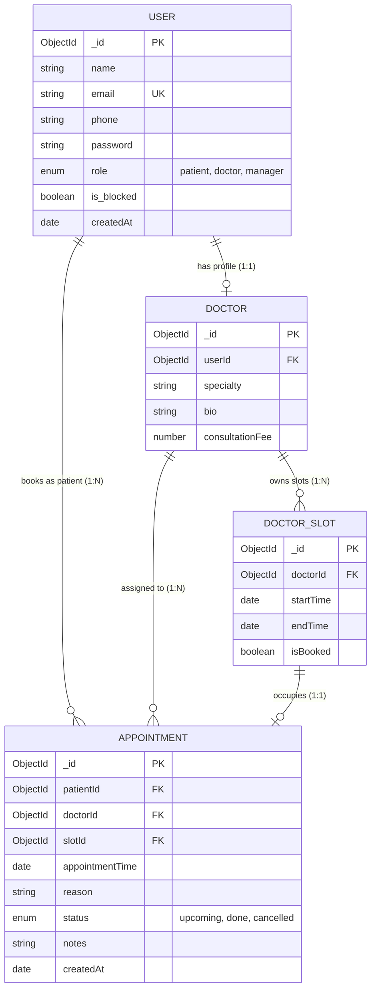

# Clinic Appointment System

A full-stack clinic appointment management platform featuring a high-performance **RESTful API** (Node.js, Express, MongoDB, JWT) and a minimalist **Single Page Application** (Vanilla JavaScript, Vite) built on an Apple-inspired design system.

<p>
  
  
  
  
  
  
  
</p>

---

## Table of Contents

- [Overview](#overview)
- [Key Features](#key-features)
- [Tech Stack](#tech-stack)
- [Project Structure](#project-structure)
- [Business Rules](#business-rules)
- [Database Design](#database-design)
- [Getting Started](#getting-started)
- [Demo Accounts](#demo-accounts)
- [API Reference](#api-reference)
- [Frontend Experience](#frontend-experience)
- [Error Handling and Validation](#error-handling-and-validation)
- [License](#license)

---

## Overview

The Clinic Appointment System streamlines scheduling between patients, doctors, and clinic administrators. It enforces a strict set of business rules at the API layer to guarantee data integrity, prevent double bookings, and preserve a complete medical history. The client is a dependency-light SPA with role-aware routing and a right-to-left capable interface with Arabic localization.

---

## Key Features

### Authentication and Role-Based Access Control

- Stateless authentication using **JSON Web Tokens (JWT)**.
- Password hashing with **bcryptjs**.
- Three distinct roles, each with a dedicated portal:

| Icon | Role | Capabilities |
|:---:|---|---|
|  | **Patient** | Search doctors by specialty, book available slots, review visit history, and cancel eligible upcoming appointments. |
|  | **Doctor** | View daily and upcoming schedules, manage availability slots, complete visits with diagnostic notes, and perform emergency cancellations. |
|  | **Manager** | Monitor clinic-wide metrics, add and edit doctors, manage and block users, and oversee all appointments. |

### Strict Business Rule Enforcement

Twelve rules covering double-booking prevention, a two-hour patient cancellation policy, active booking limits, data isolation, and a no-hard-delete policy are enforced server-side.

### Apple-Inspired Design

Minimalist typography (Inter / SF Pro), crisp card layouts with a `28px` border radius, soft surfaces (`#f5f5f7`, `#ffffff`), interactive toast notifications, seamless client-side routing, and full RTL support with Arabic localization.

---

## Tech Stack

| Layer | Technology | Description |
|:---:|---|---|
|  | **Node.js and Express.js** | High-performance RESTful API server |
|  | **MongoDB and Mongoose** | Document database with schema validation and indexes |
|  | **JWT, bcryptjs, CORS** | Token-based authentication, password hashing, and origin control |
|  | **Vanilla JS (ES Modules) and Vite** | Fast, dependency-light modern SPA |
|  | **Custom CSS (Apple tokens)** | Pure CSS implementing the project design system |
|  | **Express-Validator** | Request body and parameter validation |

---

## Project Structure

```
Clinic-Appointment-System-/
├── server.js                          # Express server entry point (port 5000)
├── package.json                       # Root dependencies and unified scripts
├── .env                               # Environment configuration
├── .env.example                       # Environment variable template
├── .gitignore
├── README.md                          # Project documentation
├── frontend/                          # Client application (Vite)
│   ├── index.html                     # SPA HTML shell
│   ├── package.json                   # Frontend dependencies
│   ├── vite.config.js                 # Dev server and API proxy configuration
│   └── src/
│       ├── main.js                    # Frontend initialization
│       ├── router.js                  # Hash router with route guards
│       ├── styles.css                 # Design system stylesheet
│       ├── services/
│       │   ├── api.js                 # Unified Fetch API client
│       │   └── auth.js                # Reactive auth state store
│       ├── utils/
│       │   ├── formatters.js          # Date, currency, status, and rule helpers
│       │   ├── toast.js               # Toast notifications
│       │   └── modal.js               # Modal and confirmation dialog manager
│       ├── components/
│       │   └── Navbar.js              # Navigation header
│       └── pages/
│           ├── auth/AuthPage.js            # Login, registration, demo logins
│           ├── patient/PatientDashboard.js # Patient booking and appointments
│           ├── doctor/DoctorDashboard.js   # Doctor schedule and slot manager
│           └── manager/ManagerDashboard.js # Statistics, doctors, user management
└── src/                               # Backend source code
    ├── app.js                         # Express app, CORS, static serving
    ├── config/
    │   └── db.js                      # MongoDB connection
    ├── models/
    │   ├── User.js                    # User schema (patient, doctor, manager)
    │   ├── Doctor.js                  # Doctor profile schema
    │   ├── DoctorSlot.js              # Availability slot schema
    │   └── Appointment.js             # Appointment record schema
    ├── controllers/
    │   ├── auth.controller.js         # Register, login, current user
    │   ├── patient.controller.js      # Doctor browsing, booking, cancellation
    │   ├── doctor.controller.js       # Schedule, slot CRUD, visit completion
    │   └── manager.controller.js      # Doctor CRUD, user blocking, statistics
    ├── routes/
    │   ├── index.js                   # Route aggregator
    │   ├── auth.routes.js
    │   ├── patient.routes.js
    │   ├── doctor.routes.js
    │   └── manager.routes.js
    ├── middlewares/
    │   ├── auth.middleware.js         # JWT verification and active-status check
    │   ├── role.middleware.js         # Role authorization
    │   ├── logger.middleware.js       # Request logging
    │   └── errorHandler.middleware.js # Standardized error handler
    ├── validators/
    │   ├── validate.js                # Validation runner
    │   ├── auth.validator.js          # Authentication input validation
    │   ├── slot.validator.js          # Slot validation
    │   └── appointment.validator.js   # Booking validation
    └── utils/
        ├── seedManager.js             # Seeds the default manager account
        └── seedDemoData.js            # Seeds the full demo dataset
```

---

## Business Rules

| # | Rule | Description and Implementation |
|:---:|---|---|
| 1 | **No Double Booking** | A time slot can be booked by only one patient at a time (`isBooked: true` combined with a unique index). |
| 2 | **No Past Bookings** | Appointments can only be booked for future times (`slot.startTime > Date.now()`). |
| 3 | **One Upcoming per Doctor** | A patient may hold at most one active upcoming appointment with the same doctor. |
| 4 | **Maximum of Three Upcoming Bookings** | A patient may hold at most three upcoming appointments across the clinic. |
| 5 | **No Slot Overlaps** | A doctor cannot create overlapping time slots on the same day. |
| 6 | **Slot Release on Cancellation** | When an appointment is cancelled, its slot automatically reverts to `isBooked = false`. |
| 7 | **Two-Hour Cancellation Policy** | Patients may cancel only up to two hours before the start time. Doctors and managers are exempt. |
| 8 | **Immutable Finished Records** | Appointments marked `done` or `cancelled` cannot be modified or cancelled again. |
| 9 | **Doctor-Specific Completion** | Only the assigned doctor can mark an appointment as `done` and record medical notes. |
| 10 | **Data Isolation** | Patients and doctors can access only their own records. Managers have clinic-wide visibility. |
| 11 | **Blocked User Prevention** | Blocked users (`is_blocked: true`) cannot log in or perform any action through the API or UI. |
| 12 | **No Hard Deletes** | Appointments and historical medical records are never deleted from the database. |

---

## Database Design



---

## Getting Started

### 1. Prerequisites

- **Node.js** v18 or higher
- **MongoDB** running locally (`mongodb://127.0.0.1:27017`) or a remote MongoDB Atlas URI

### 2. Installation

```bash
# Install backend dependencies
npm install

# Install frontend dependencies
cd frontend && npm install && cd ..
```

### 3. Environment Configuration

Create a `.env` file in the project root (use `.env.example` as a template):

```env
PORT=5000
MONGODB_URI=mongodb://localhost:27017/clinic_appointment_system
JWT_SECRET=replace_with_a_long_random_secret
JWT_EXPIRES_IN=7d

# Manager credentials used by the seeder
MANAGER_NAME=Admin Manager
MANAGER_EMAIL=manager@clinic.com
MANAGER_PASSWORD=Manager@123
MANAGER_PHONE=0500000000
```

> **Security note:** Always replace `JWT_SECRET` and the default manager password before deploying to any non-local environment.

### 4. Database Seeding

**Option A: Full demo dataset (recommended)**

Populates the database with a manager, five doctors across multiple specialties (Cardiology, Dermatology, Pediatrics, Dentistry, Orthopedics), weekly availability slots, sample patients, and sample appointments.

```bash
npm run seed:demo
```

**Option B: Manager account only**

```bash
npm run seed
```

### 5. Running the Application

**Development mode (hot reloading)**

Open two terminals:

```bash
# Terminal 1: backend API (port 5000)
npm run dev
```

```bash
# Terminal 2: frontend (port 3000)
npm run client
```

Open `http://localhost:3000`. Vite automatically proxies `/api` requests to the backend.

**Unified single-port mode**

Build the frontend and serve everything from the Express server:

```bash
# Build the frontend bundle
npm run client:build

# Start the server
npm start
```

Open `http://localhost:5000`.

---

## Demo Accounts

After running `npm run seed:demo`, all three roles can be tested using the quick-login buttons on the login page or the credentials below.

| Role | Name | Email | Password |
|---|---|---|---|
| Manager | System Manager | `manager@clinic.com` | `Manager@123` |
| Doctor (Cardiology) | Dr. Ahmed Al-Mansour | `ahmed.doctor@clinic.com` | `Doctor@123` |
| Doctor (Dermatology) | Dr. Sarah Khalil | `sarah.doctor@clinic.com` | `Doctor@123` |
| Doctor (Pediatrics) | Dr. Omar Farouk | `omar.doctor@clinic.com` | `Doctor@123` |
| Patient | Tariq Mahmoud | `tariq.patient@clinic.com` | `Patient@123` |
| Patient | Reem Abdullah | `reem.patient@clinic.com` | `Patient@123` |

These accounts are intended for local development and demonstration only.

---

## API Reference

Base URL: `http://localhost:5000/api`

All protected endpoints require the header `Authorization: Bearer <token>`.

### Authentication (`/api/auth`)

| Method | Endpoint | Access | Description |
|---|---|---|---|
| `POST` | `/api/auth/register` | Public | Register a new patient account |
| `POST` | `/api/auth/login` | Public | Authenticate with email and password |
| `GET` | `/api/auth/me` | Bearer | Retrieve the current authenticated user |

### Patient (`/api/patients`)

Requires the **Patient** role.

| Method | Endpoint | Description |
|---|---|---|
| `GET` | `/api/patients/doctors` | Browse doctors (optional filter: `?specialty=`) |
| `GET` | `/api/patients/doctors/:doctorId` | View a single doctor profile |
| `GET` | `/api/patients/doctors/:doctorId/slots` | List available slots (optional filter: `?date=YYYY-MM-DD`) |
| `POST` | `/api/patients/appointments` | Book an appointment with `{ slotId, reason }` |
| `GET` | `/api/patients/appointments` | List own appointments (optional filter: `?status=upcoming`, `done`, or `cancelled`) |
| `PATCH` | `/api/patients/appointments/:id/cancel` | Cancel an appointment (enforces Rule 7) |

### Doctor (`/api/doctors`)

Requires the **Doctor** role.

| Method | Endpoint | Description |
|---|---|---|
| `GET` | `/api/doctors/profile` | Retrieve own profile |
| `GET` | `/api/doctors/slots` | List own slots (optional filters: `?date=`, `?booked=true` or `false`) |
| `POST` | `/api/doctors/slots` | Create an availability slot with `{ startTime, endTime }` |
| `DELETE` | `/api/doctors/slots/:slotId` | Delete an unbooked slot |
| `GET` | `/api/doctors/appointments` | List scheduled appointments (optional filters: `?status=`, `?date=`) |
| `PATCH` | `/api/doctors/appointments/:id/complete` | Complete a consultation with `{ notes }` |
| `PATCH` | `/api/doctors/appointments/:id/cancel` | Emergency cancellation by the doctor |

### Manager (`/api/manager`)

Requires the **Manager** role.

| Method | Endpoint | Description |
|---|---|---|
| `POST` | `/api/manager/doctors` | Register a new doctor with a profile |
| `PUT` | `/api/manager/doctors/:doctorId` | Update a doctor's name, phone, specialty, fee, or bio |
| `DELETE` | `/api/manager/doctors/:doctorId` | Delete a doctor account only when it has no appointments or booked slots; appointment records are retained |
| `GET` | `/api/manager/doctors` | List all doctors |
| `GET` | `/api/manager/users` | List users (optional filters: `?role=`, `?is_blocked=`, `?search=`) |
| `PATCH` | `/api/manager/users/:userId/block` | Block or unblock a user with `{ is_blocked: true }` or `{ is_blocked: false }` |
| `GET` | `/api/manager/appointments` | List all clinic appointments |
| `PATCH` | `/api/manager/appointments/:id/cancel` | Cancel any appointment |

---

## Frontend Experience

| Portal | Highlights |
|---|---|
| **Patient** | Search doctors by specialty, select future dates, view live availability, provide a visit reason, book instantly, review past notes, and cancel with a remaining-time indicator. |
| **Doctor** | Daily agenda, patient contact details, consultation completion dialog with diagnostic notes, slot creation with overlap protection, and slot deletion. |
| **Manager** | Real-time KPI cards, add, edit, and guarded delete doctor actions, a user directory with instant block and unblock toggles, and clinic-wide appointment oversight. |

Additional behavior:

- **Toast notifications** provide non-intrusive feedback for success, error, and validation events.
- **Route guards** protect restricted pages. A role mismatch redirects the user to their appropriate portal.

---

## Error Handling and Validation

All API responses follow a consistent JSON structure.

**Error response**

```json
{
  "success": false,
  "message": "Appointments cannot be cancelled less than two hours before the scheduled time."
}
```

**Validation error response**

```json
{
  "success": false,
  "message": "Validation failed",
  "errors": [
    { "field": "email", "message": "Please provide a valid email address" },
    { "field": "password", "message": "Password must be at least 6 characters" }
  ]
}
```

---

## License

Distributed under the ISC License.